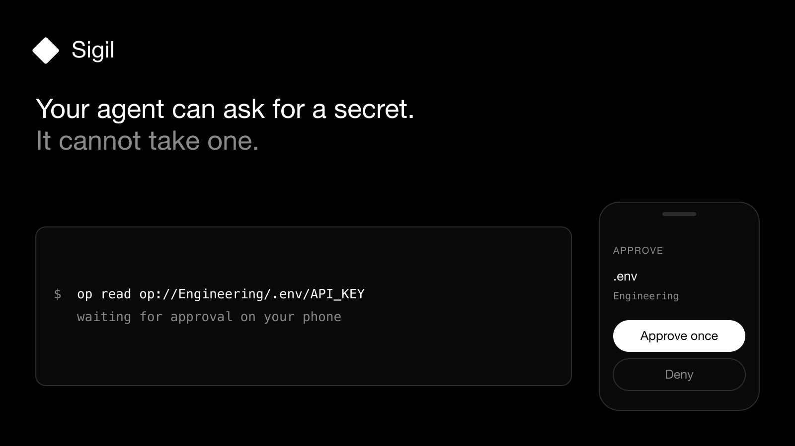
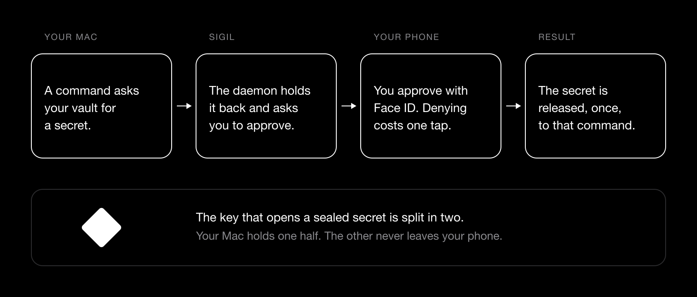

<p align="center">
  
</p>

<h1 align="center">Sigil</h1>

<p align="center">When a program on your Mac reaches for a secret, the request holds until you approve it on your phone with Face ID.</p>



## Getting started

1. **Install the CLI.** With Homebrew:

   ```sh
   brew tap rainnworks/tap && brew trust rainnworks/tap
   brew install sigil
   ```

   Or download `sigil-x.y.z-aarch64-apple-darwin.tar.gz` from
   [Releases](https://github.com/RainnWorks/sigil/releases) and put `sigil` and
   `sigil-config` on your `PATH`.
2. **Get the app for your iPhone.** It is coming to the App Store. It is in TestFlight testing now.
3. **Run setup.**

   ```sh
   sigil setup
   ```

   It makes your Mac's half of the key, installs the `op` shim, puts `~/.sigil/bin` first on your `PATH`, loads the background agent, and then shows a pairing QR. Running it again is safe.
4. **Pair the phone.** Scan the QR in the app. Your Mac and your phone each show the same six words. Read both lists. If they differ, cancel the pairing: the connection is not private. The app asks for the camera once, and for Face ID.
5. **Gate your first command.**

   ```sh
   sigil-config add op --provider 1password
   sigil op read "op://Private/GitHub/token"
   ```

   The terminal waits. Your phone asks. Approve with Face ID and the value prints. Deny, or do nothing, and the command fails.
6. **Optional: let a bare `op` reach Sigil.**

   ```sh
   sigil-config proxy add op
   ```

   Now anything that runs `op` is gated, including an agent you did not write.

Sigil needs macOS, and an iPhone with Face ID or Touch ID. It is free, and it has
no accounts to make.

## Use

`sigil status` shows the state of the daemon, the shim, `op` and the pairing.
`sigil doctor` explains anything that looks wrong.

A command with no rule is refused. These are the changes you will make most:

| You want | Command |
|---|---|
| Gate a command | `sigil-config add <cmd> --provider <id>` |
| Cover a window instead of one run | add `--leasable --lease-max 900` |
| List what is configured | `sigil-config list` |
| Stop gating a command | `sigil-config remove <cmd>` |
| See and end open windows | `sigil lease list`, `sigil lease revoke <id-prefix>` |
| Gate an SSH key | `sigil ssh add-file --path ~/.ssh/id_ed25519` |
| See what was asked and what you answered | `sigil history` |
| Read or change preferences | `sigil-config settings get`, `sigil-config settings set <key> <value>` |

`add` is the short form. Write the source and the rule separately when you want
a narrower match. This gates `op read` and leaves every other `op` command
alone:

```sh
sigil-config source add op --provider 1password
sigil-config rule add op-read --source op --command op --subcommand read
```

A rule can also match on an exact flag (`--flag-eq --account=work`), on a flag
being present (`--flag --json`), or on a string anywhere in the arguments
(`--argv-contains prod`).

To hold a value yourself, make an `env` source and seal one key into it. The
value is read from stdin, so it never reaches your shell history:

```sh
sigil-config source add aws --provider env
printf '%s' "$SECRET" | sigil-config source env set aws --key AWS_SECRET_ACCESS_KEY
```

There are three providers. `1password` gates `op` and injects nothing, because
`op` does its own authentication. `env-file` injects `KEY=VALUE` pairs from a
file you name. `env` injects values you sealed into Sigil yourself.

By default an approval covers one run. A rule marked `--leasable` lets you
choose, at the moment you approve, to cover the same rule for a window instead.
The cap is 15 minutes unless you set `--lease-max`. A window lives in memory
only. It ends on expiry, on revoke from your Mac or your phone, when the daemon
restarts, and when you change the rule it came from.

The default approval timeout is 120 seconds. History keeps 30 days. The relay is
`https://relay.rainn.works` until you set your own.

Sigil also has a Mac app: a menubar item and a window that do the same things.
Everything it does, the CLI does headless.

## How it works



The one thing worth understanding is the split key. Sigil never holds a key that
can open your sealed values on its own. That key is split in two: your Mac keeps
one half in `~/.sigil/keystore.json`, and the other half never leaves your
phone's Secure Enclave. Approving is the act of sending your phone's
contribution for that one request, behind a hardware biometric. Both halves are
wiped from memory as soon as the request finishes.

For a command that fetches its own secret, `op` above all, Sigil holds nothing
at all. It stops the command, asks you, and then runs the real program. That
program writes the secret straight to whoever called it. The secret bytes never
pass through Sigil.

Four rules shape the rest of it:

- **It fails closed.** Approve needs Face ID. Deny needs nothing. Silence denies.
- **The phone is blind.** It sees the caller and the command. It never sees the secret.
- **The relay is blind.** Sealed envelopes, held in memory for seconds. Nothing stored, no accounts.
- **Any provider.** 1Password first, then SSH keys and environment variables, behind the same rule: if this, then ask me.

## Limits

- **Android cannot approve.** The approver is iOS only. Android needs a StrongBox module that does not exist yet.
- **Approval covers the command, not what the command does next.** Once you approve, the program holds the secret and Sigil stops watching.
- **A window covers the whole rule.** While a lease is open, every command that rule matches runs with no tap.
- **Sigil cannot prove your phone used its Secure Enclave.** The app has no path that approves without a hardware-gated key operation, but your Mac sees only the answer, not the hardware behind it.
- **No phone, no secret.** An unreachable phone, a dead relay, an expired request and a stopped daemon all deny.

## Build from source

```sh
cargo install --path crates/sigil
cargo test && cargo clippy --all-targets -- -D warnings && cargo fmt --check
```

`cargo test` also runs a documentation gate. A claim in `docs/security-claims.md`
may not name a proving test that is not in the tree. Adding a claim without its
test fails the build.

The iPhone app is an Expo project. It uses the Secure Enclave, so it cannot run
in Expo Go and needs a device build:

```sh
cd apps/phone
bun install
bunx expo run:ios
```

The Mac app needs Xcode 26 or later:

```sh
cd apps/mac
xcodegen generate
xcodebuild -project Sigil.xcodeproj -scheme Sigil -configuration Debug \
  -destination 'platform=macOS' build CODE_SIGNING_ALLOWED=NO
```

Where things live:

| Path | What |
|---|---|
| `crates/sigil` | The daemon, the shim and both CLI binaries |
| `crates/sigil-proto` | Sealed and signed envelopes, pairing, threshold crypto, and the hostile-relay test suite |
| `crates/sigil-relay` | The blind relay, one static binary |
| `apps/phone` | The iOS approver (Expo) |
| `apps/mac` | The menubar item and configurator (SwiftUI) |
| `docs/design` | The design brief, which is the constitution |
| `docs/security-claims.md` | Review verdicts and the residuals still open |

## Run your own relay

The shared relay is `https://relay.rainn.works`. To run your own, build the
static binary and put it behind TLS:

```sh
cargo build --release -p sigil-relay
```

`deploy/gcp/` holds a working runbook for one small VM behind Caddy.
`crates/sigil-relay/Dockerfile` builds the same binary into a `scratch` image;
build it from the repository root. There is no password and no account, because
there is nothing there to protect. Point Sigil at it with
`sigil pair --relay https://your-relay`.

## Release

Pushing a tag runs the release workflow:

```sh
git tag v0.1.0 && git push origin v0.1.0
```

It cross-compiles `sigil` and `sigil-config` for Apple silicon and Intel,
attaches the tarballs and their checksums to a GitHub Release, renders the
Homebrew formula, builds the relay binary and its container image, and publishes
the release. Putting the rendered formula into
[`RainnWorks/homebrew-tap`](https://github.com/RainnWorks/homebrew-tap) is still
a manual step.

## Security

The design and the threat model are in
[`docs/design/sigil-design-brief.html`](docs/design/sigil-design-brief.html).
Review verdicts, and the limits still open, are in
[`docs/security-claims.md`](docs/security-claims.md). This is early software.
Read the code before you trust it with anything that matters. If you find a
problem, please report it privately first.

## Credits

Sigil started from the design of [wyattjoh/op-remote](https://github.com/wyattjoh/op-remote).

## License

[Apache-2.0](LICENSE). Copyright 2026 Rainnworks.
