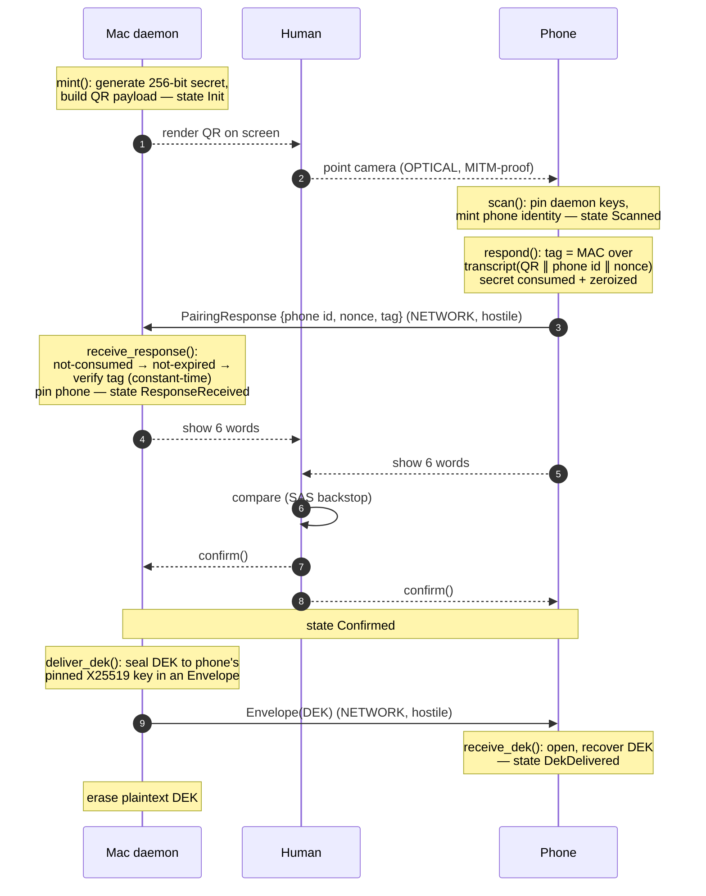

# Pairing: the root of trust

Pairing is the one moment where Latch establishes who is who. Everything after
it (every secret release, every SSH signature, every lease) rests on the keys
pinned here. If pairing is sound, a fully hostile network can carry every byte
between the Mac and the phone and still never read a request or forge an
approval. This document describes the ceremony, the crypto that authenticates
it, and why each choice is the one made.

Implementation: `crates/proto/src/pairing.rs`. Tests: same file (`mod tests`)
plus the MITM suite the security-reviewer owns.

## The asymmetry, and why it exists

The two directions of pairing are protected by different things, on purpose.

**Mac -> phone is optical.** The Mac renders a QR code on its own screen; the
phone reads it with its camera. No network hop sits between a screen and a lens,
so this channel is authenticated *by physics*. A man-in-the-middle would have to
be physically present, pointing a second camera, replacing the image in real
time. Against that we do not defend with cryptography; we defend with the human
holding the two devices. The QR therefore safely carries the daemon's real
public keys, and the phone pins them with certainty.

**Phone -> Mac is a network message.** The phone's reply travels over whatever
transport is available (LAN, an owned endpoint, or the blind relay), and we
assume that transport is fully malicious: it can read, drop, reorder, duplicate,
mutate, and manufacture messages, and it knows both parties' *public* keys.
Nothing physical protects this leg. If it were unauthenticated, a network
attacker could substitute its own public key for the phone's, and the daemon
would pin the attacker as "the phone" — the attacker would then approve its own
requests forever. This is the one substitution the ceremony must stop.

The QR is what makes stopping it possible. Besides the daemon's public keys and
its reachable endpoints, the QR carries a **256-bit one-time pairing secret**
generated fresh from the CSPRNG. Because the QR moved optically, only the real
phone learns that secret. The phone's reply is authenticated by proving
possession of it. A network attacker who never saw the QR cannot produce a valid
proof, so it cannot pass off its own key. **The optical channel bootstraps a
secret; the secret closes the return channel.**

## The messages

| # | Name | Direction | Channel | Carries |
|---|------|-----------|---------|---------|
| 0 | `PairingPayload` | Mac -> phone | optical (QR) | daemon `PeerIdentity`, endpoints, `PairingSecret` (256-bit), `created_at` |
| 1 | `PairingResponse` | phone -> Mac | network | phone `PeerIdentity`, `nonce` (256-bit), confirmation `tag` (256-bit) |
| 2 | SAS | human | eyes / voice | six words, read off both screens and compared |
| 3 | DEK delivery | Mac -> phone | network | the 256-bit DEK, sealed to the phone's pinned key inside an `Envelope` |

Message 0 is the pre-existing `PairingPayload` (QR encode/decode unchanged).
Messages 1-3 are the handshake added here.

## The ceremony, step by step

1. **Mint (daemon, `PairingState::Init`).** `DaemonPairing::mint` generates the
   one-time secret, builds the `PairingPayload`, and keeps its own copy of the
   secret, its public identity, the endpoints, and `created_at`. The Mac renders
   the payload as a QR.

2. **Scan (phone, `PairingState::Scanned`).** `PhonePairing::scan` decodes the
   QR, rejects it if it is older than the secret lifetime, mints the phone's own
   Ed25519 + X25519 identity, and **pins the daemon's keys**. The daemon is now
   trusted absolutely by the phone, because the QR was optical.

3. **Respond (phone -> Mac).** `PhonePairing::respond` computes the transcript
   and the confirmation tag (below), packages them with the phone's public
   identity and a fresh nonce into a `PairingResponse`, and **consumes the
   phone's copy of the secret** (it is `take`-n out and zeroized as the call
   returns). The phone can respond exactly once.

4. **Verify + pin (daemon, `PairingState::ResponseReceived`).**
   `DaemonPairing::receive_response` enforces, in order: the secret has not
   already been consumed; the state is `Init`; the QR has not expired; and the
   confirmation tag verifies (constant-time). Only a cryptographically valid
   response burns the secret and pins the phone's key. A response that fails the
   tag leaves the secret intact, so a network attacker spraying garbage cannot
   exhaust it, while a *valid* one is one-time by construction.

5. **SAS (both, `PairingState::Confirmed`).** Both devices compute
   `fingerprint_words` over the two now-pinned identities and display the same
   six words. `sas_words()` on each driver returns them; `verify_sas` is the
   pure check. The human confirms the words match on both screens and calls
   `confirm()` on each side. See "Why SAS" below.

6. **DEK handoff (Mac -> phone, `PairingState::DekDelivered`).**
   `DaemonPairing::deliver_dek` seals the 256-bit DEK to the phone's pinned
   X25519 key inside a standard `Envelope` (crypto_box seal + Ed25519 signature
   + replay fields) and advances to `DekDelivered`. `PhonePairing::receive_dek`
   opens it and recovers the DEK. The daemon then erases its plaintext DEK; from
   here on the DEK arrives per-approval from the phone. The DEK may also be
   wrapped a second time to the Mac's Secure Enclave identity
   (`wrap_dek_for`) for local Touch ID approvals.



## The confirmation tag (how the secret closes the return channel)

The phone authenticates its reply with a MAC keyed by a value derived from the
pairing secret, over a transcript that binds everything that must not be
swapped.

**Transcript.** `pairing_transcript` hashes, with length-prefixed fields under a
domain separator (`latch.pairing.v1`):

```
H( domain
   ∥ daemon.verifying ∥ daemon.agreement      // who the phone thinks it is talking to
   ∥ endpoints                                 // the rest of the QR
   ∥ created_at
   ∥ phone.verifying ∥ phone.agreement         // the key being claimed
   ∥ nonce )                                   // uniqueness
```

Each binding earns its place:

- **daemon identity** — a response tagged for pairing A cannot be replayed
  against a freshly minted pairing B; B's daemon identity differs, so the
  transcript (and B's independent secret) reject it.
- **phone identity** — the tag covers exactly the key in the message. A network
  attacker who swaps `resp.phone` for its own key invalidates the tag and cannot
  recompute it without the secret. This is the core MITM defense.
- **nonce** — makes each response unique and one-shot.

The secret is deliberately **not** in the transcript; it is the MAC key, not
part of the signed message. So the transcript is a public value that leaks
nothing about the secret — a clean seam to hand a reviewer.

**Subkey then MAC.**

```
K_confirm = BLAKE2bMac(key = secret,    msg = domain ∥ "confirm-tag")   // KDF
tag       = BLAKE2bMac(key = K_confirm, msg = transcript)               // MAC
```

Verification recomputes the MAC and calls `Mac::verify_slice`, which compares in
**constant time**, so a wrong tag leaks no timing signal about how many bytes
matched.

## Crypto rules and the choices behind them

- **BLAKE2b for both KDF and MAC (no SHA-256, no `hkdf`/`hmac`/`sha2` crates).**
  The crate already depends on `blake2` (fingerprints and mailbox ids are
  BLAKE2b). BLAKE2b's keyed mode is a first-class PRF, so it serves as both
  HKDF-Expand and HMAC with zero new dependencies. SHA-256 would be an equally
  sound primitive but would pull three crates for no security gain. The `blake2`
  MAC type gives a constant-time `verify_slice` for free.
- **No HKDF-Extract.** RFC 5869 §3.3: extraction is only needed to condition
  non-uniform input keying material. Our IKM is a 256-bit CSPRNG output, already
  uniform, so we skip Extract and use Expand alone. `derive_subkey` is exactly
  HKDF-Expand with a single-block `info`.
- **No key reuse across purposes.** The MAC key is derived from the secret under
  a distinct label (`confirm-tag`) and is unrelated to the device signing and
  agreement keys, which are independent long-term keys. The pairing secret is
  used only to key the confirmation MAC and is then destroyed.
- **Constant-time comparison.** Tag verification is `verify_slice`, never `==`.
  `Dek`, `Envelope`, and `PairingResponse` deliberately do **not** implement
  `PartialEq`, so no accidental variable-time comparison of key or tag material
  can creep in.
- **CSPRNG everywhere.** The pairing secret, the response nonce, and the DEK all
  come from `rand_core::OsRng`.
- **Zeroization.** `PairingSecret` and `Dek` are `ZeroizeOnDrop` and redact
  their `Debug`. The phone `take`s the secret out on `respond()` so it is
  zeroized immediately, not merely when the driver drops. The `Envelope` seals
  and opens plaintext through `Zeroizing` buffers already.

## Why no PAKE

A PAKE (SPAKE2, OPAQUE, etc.) exists to turn a **low-entropy** shared secret — a
human-chosen password an attacker could guess offline — into a mutually
authenticated key without exposing it to a dictionary attack. That is not our
situation. Our shared secret is a full **256-bit CSPRNG value** transferred over
an optical channel; there is no low-entropy human input to protect and nothing
to guess. An online attacker gets one shot per response and the secret is
one-time; an offline attacker faces 2^256. A simple KDF-then-MAC proof of
possession is therefore exactly sufficient, and a PAKE would add protocol
rounds, code, and a dependency to defend against a threat (dictionary attack on
a weak password) that our secret does not have. High-entropy optical secret in,
plain MAC out.

## Why SAS is the human backstop

The tag already stops a network MITM, so what is SAS for? It is defense in
depth against the ways the tag's assumptions could fail:

- The secret leaking (a compromised QR: shoulder-surfed, photographed, screen
  captured). If someone else obtained the secret, they could forge a valid
  response. SAS catches it, because the six words are computed over the two
  *pinned* identities: if the daemon pinned an attacker's key instead of the
  phone's, the daemon's words and the phone's words differ, and the human sees
  the mismatch.
- Any future bug in the tag path. SAS is an independent check that does not
  share code with the MAC, so a mistake in one is caught by the other.

`fingerprint_words` is order-independent (it sorts the two identities before
hashing), so both devices derive the same six words iff they pinned the same
pair of keys. The words are shown on both screens; the human is the comparator.
Reading six words aloud is cheap and the failure mode is loud.

## Secret lifetime and one-time use

- **Lifetime.** `PAIRING_SECRET_TTL_MS` defaults to 180s. The phone rejects a
  stale QR at `scan`; the daemon rejects a late response at `receive_response`,
  checking expiry *before* the tag. A short window bounds how long a
  photographed QR is useful.
- **One-time (daemon side).** The first cryptographically valid response sets
  `consumed`; any later response — even a perfectly valid one from a second
  device that scanned the same QR — is refused with `SecretConsumed`. A failed
  attempt does not consume the secret, so a transient network error is
  recoverable but a second success is not possible.
- **One-time (phone side).** `respond()` `take`s the secret out and zeroizes it,
  so the phone likewise emits exactly one response.

## State machine

`PairingState` is the shared vocabulary; each driver enforces its own legal
transitions and returns `HandshakeError::WrongState` on any illegal one.

```
daemon:  Init ──receive_response──▶ ResponseReceived ──confirm──▶ Confirmed ──deliver_dek──▶ DekDelivered
phone:   Scanned ──(respond)──────────────────────────confirm──▶ Confirmed ──receive_dek──▶ DekDelivered
```

`deliver_dek` requires `Confirmed`: a key that no human ever confirmed via SAS
never receives the DEK. This is a hard gate, tested.

## Seams for the security-reviewer's MITM suite

The handshake is built to be attacked at clean, public boundaries. Each of these
is a documented place to mount an attack and assert it fails closed:

- **`PairingResponse` fields are public and mutable in a test.** Swap `phone`
  for an attacker key, flip a bit in `tag`, replace `nonce` — then assert
  `receive_response` returns `BadTag`. (`tag_rejected_when_phone_key_substituted`
  is the seed; the suite should fuzz every field.)
- **`PairingResponse::build` / `verify` are exposed.** Construct a response under
  a wrong secret, wrong daemon identity, or wrong endpoints and assert `verify`
  is `false`. Cross-pairing replay (`response_replayed_against_fresh_pairing`)
  goes here.
- **`pairing_transcript` binding.** The reviewer should confirm every bound field
  actually changes the transcript (mutate daemon id, endpoints, created_at,
  phone id, nonce independently and assert the tag no longer verifies).
- **Expiry and one-time-use gates.** Drive `receive_response` with a late clock
  (`SecretExpired`) and with a second valid response (`SecretConsumed`); confirm
  a failed attempt does *not* burn the secret.
- **SAS divergence.** `verify_sas` over mismatched daemon identities must be
  `false`; the suite should confirm the words diverge whenever the pinned pairs
  differ.
- **DEK delivery is a standard `Envelope`.** The full hostile-relay suite
  (`tests/hostile_relay.rs`) already applies: forge, tamper, replay, reorder,
  backdate. `open_dek` with a wrong sender key must be `BadSignature`; a wrong
  recipient must be `Decrypt`.
- **Constant-time.** Tag comparison is `verify_slice`; the reviewer should verify
  no `==` on tags/keys exists and that `Dek`/`PairingResponse` never gain
  `PartialEq`.

## Device-side unknowns — NEEDS VERIFICATION

This crate defines the protocol and its in-memory operations. The following
depend on platform behavior outside `crates/proto` and must be verified when the
device layers land:

- **NEEDS VERIFICATION:** the phone mints its X25519 agreement key such that the
  private half is usable for crypto_box `open` while ideally residing in
  StrongBox / Secure Enclave. If the platform keystore cannot perform X25519
  agreement in hardware, document where the private key lives in software and for
  how long.
- **NEEDS VERIFICATION:** the Mac Secure Enclave's public identity used by
  `wrap_dek_for`. The SE second-recipient wrap assumes an SE-held X25519 key the
  Enclave can open against for local Touch ID approvals; confirm the SE exposes a
  usable agreement public key and that the DEK envelope can be opened by the SE
  seam (`apps/mac`).
- **NEEDS VERIFICATION:** QR camera capture fidelity and the practical upper
  bound on payload size (endpoints list length) for reliable single-frame scans.
- **NEEDS VERIFICATION:** clock skew between Mac and phone against the 180s TTL in
  the field; the envelope layer already enforces a separate 90s window on
  subsequent traffic.
